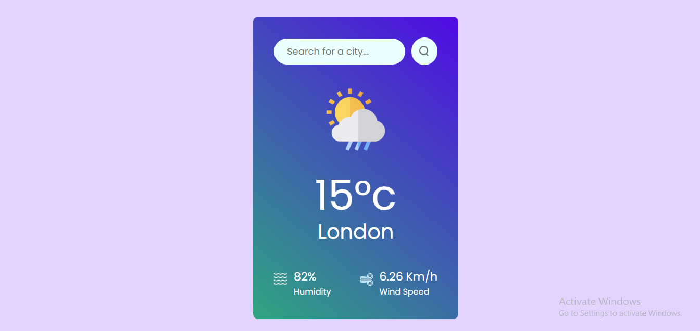

# 🌤️ CloudCu – Weather App

CloudCu is a sleek and responsive weather application that provides real-time weather updates for any city worldwide. Built with React and powered by the OpenWeatherMap API, CloudCu offers users an intuitive interface to check current weather conditions effortlessly.

## 🚀 Live Demo

Experience the application live: [https://cloudcu.netlify.app/](https://cloudcu.netlify.app/)

## 🖼️ Features

- **Real-Time Weather Data**: Fetches current weather information for any city globally.
- **Responsive Design**: Optimized for desktops, tablets, and mobile devices.
- **Dynamic Icons**: Displays weather-specific icons that change based on conditions and time of day.
- **Temperature Display**: Shows temperature in Celsius with the degree symbol (°C).
- **Error Handling**: Provides user-friendly messages for invalid city entries or API errors.

## 🛠️ Technologies Used

- **Frontend**: React, HTML5, CSS3
- **API**: OpenWeatherMap API
- **Deployment**: Netlify

## 📦 Installation

To run the project locally:

1. **Clone the repository**:

   ```bash
   git clone https://github.com/yourusername/cloudcu.git
   ```

2. **Navigate to the project directory**:

   ```bash
   cd cloudcu
   ```

3. **Install dependencies**:

   ```bash
   npm install
   ```

4. **Start the development server**:

   ```bash
   npm start
   ```

   The application will run at `http://localhost:3000`.

## 🔧 Configuration

To fetch weather data, you'll need an API key from OpenWeatherMap:

1. **Obtain an API key**:

   Sign up at [OpenWeatherMap](https://openweathermap.org/api) and generate an API key.

2. **Create a `.env` file** in the root directory and add your API key:

   ```env
   REACT_APP_WEATHER_API_KEY=your_api_key_here
   ```

   Replace `your_api_key_here` with your actual API key.

## 📁 Project Structure

```
cloudcu/
├── public/
│   └── index.html
├── src/
│   ├── components/
│   │   └── WeatherCard.js
│   ├── App.js
│   ├── index.js
│   └── App.css
├── .env
├── package.json
└── README.md
└── weather.png
```

## 🖼️ Screenshots



## 🤝 Contributing

Contributions are welcome! If you'd like to enhance the app or fix issues:

1. Fork the repository.
2. Create a new branch: `git checkout -b feature-name`.
3. Commit your changes: `git commit -m 'Add feature'`.
4. Push to the branch: `git push origin feature-name`.
5. Open a pull request.

## 📄 License

This project is licensed under the [MIT License](LICENSE).
